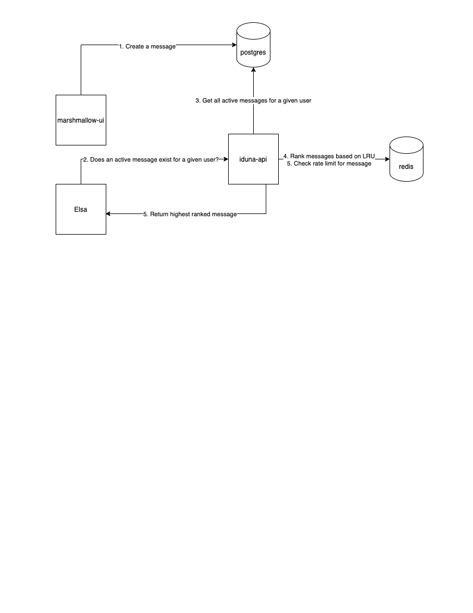

# Elsa

Elsa is HTV's Discord bot. It talks to `iduna`, which is an API that exposes a ranking service for messages, that are created through `marshmallow-ui`, a Streamlit app. When a user messages a Discord server that Elsa has been added to, a request is made to `iduna` to get the highest ranked message for a user. `iduna` ranks messages based on the least recently sent message, and rate limits messages as well. If an eligible message exists, `iduna` will send it back to Elsa, and Elsa will relay it back to Discord.



# Setup
Before running:
1) Set up `iduna` API to run locally
2) Set up a local postgres and initialize it with the sql script found in `iduna` repository
3) Set up a local Redis server
4) [Optional] Set up `marshmallow-ui` frontend app

Just run the script `setup.sh` to initialize env variables once the setup is complete

```
$ source ./setup.sh
```
